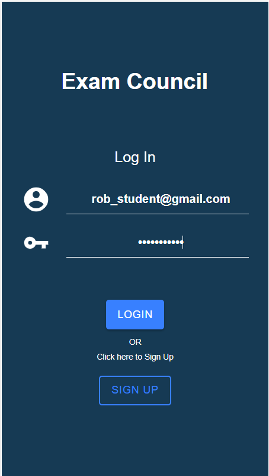
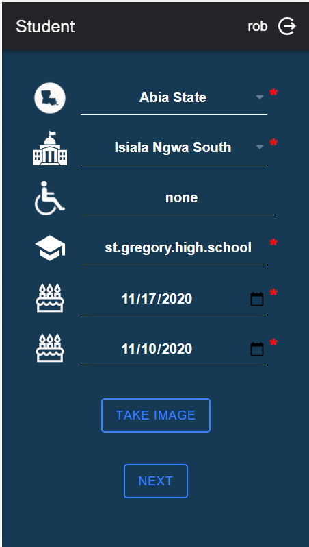
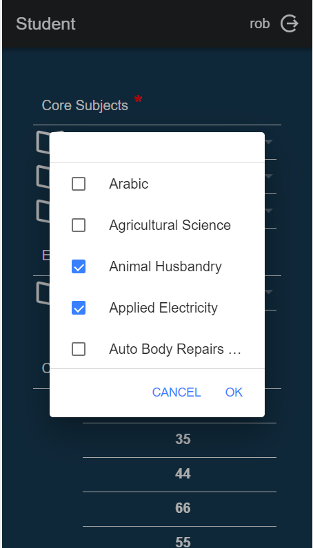
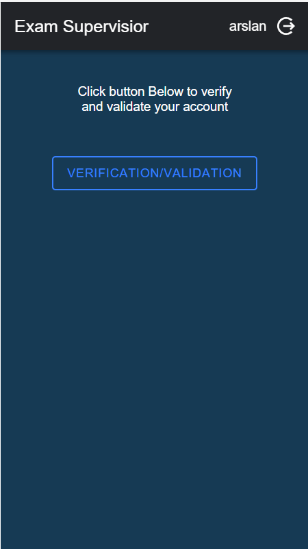

# exam-council-ionic-frontend

# Exam Management (Exam-Council) Ionic App

This is an eCommerce app, it consist of 3 panels

1. Exam supervisor Panel
2. Invigilator Panel
3. Student Panel

## Getting Started

### Installing

```
git clone https://gitlab.com/arslanfareed/exam-council-ionic-frontend.git
```

### **Images**

<hr />

<div>

<span style="float:left; width:25%; margin:4%">
<h3>Login Page</h3>

</span>
<br />

<span>
<h3>Student-Academic-Details-1</h3>

</span>
<br />

<span>
<h3>Student-Academic-Details-2</h3>

</span>
<br />

<span>
<h3>Exam-Supervisor-Verification-Page</h3>

</span>
<br />
<br />

### **Credentials**

<hr />

**Exam supervisor:**<br>
**E-Mail:** arslan_admin@gmail.com<br>
**Password:** Password123<br>

**Invigilator:**<br>
**E-Mail:** john_invigilator@gmail.com <br>
**Password:** Password123<br>

**Student:**<br>
**E-Mail:** rob_student@gmail.com <br>
**Password:** Password123<br>

</div>

## Authors

- **Arslan Fareed**
